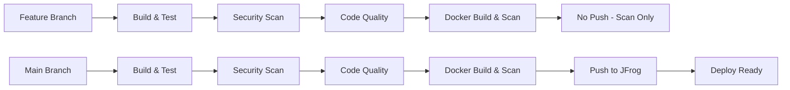

# .NET Web API CI/CD POC

A Proof of Concept (POC) demonstrating a comprehensive CI/CD pipeline for a .NET 8 Web API using GitHub Actions, JFrog Artifactory, and enterprise-grade security scanning.

## Features

- **🚀 .NET 8 Web API**: Modern ASP.NET Core Web API with Weather Forecast sample
- **🐳 Alpine Docker**: Lightweight Alpine Linux-based Docker containers (~181MB)
- **⚡ Advanced CI/CD Pipeline**: Multi-stage GitHub Actions workflow with comprehensive quality gates
- **📦 JFrog Integration**: Docker image publishing to JFrog Artifactory with OIDC authentication
- **🧪 Automated Testing**: Unit tests with coverage reporting and result visualization
- **🛡️ Security Scanning**: Snyk vulnerability scanning for code dependencies and container images
- **📊 Code Quality**: SonarQube/SonarCloud integration for code quality analysis
- **🔒 Enterprise Security**: Non-root Docker containers, SARIF reporting, and proper secrets management
- **🏷️ Smart Tagging**: Semantic versioning with date-commit format for better traceability
- **📋 Rich Reporting**: Comprehensive GitHub Actions summaries for all pipeline stages

## Project Structure

```
dotnet-webapi/
├── Dotnet.Webapi/                 # Main Web API project
│   ├── Controllers/               # API controllers
│   ├── Dockerfile                 # Alpine-based container definition
│   └── Program.cs                 # Application entry point
├── Dotnet.Webapi.Tests/          # Unit test project
│   ├── CustomWebApplicationFactory.cs  # Test infrastructure
│   └── WeatherForecastControllerTests.cs  # Controller tests
├── .github/workflows/             # GitHub Actions workflows
│   └── ci-pipeline.yml           # Comprehensive CI/CD pipeline
└── dotnet-webapi.sln             # Visual Studio solution
```

## Local Development

### Prerequisites

- .NET 8 SDK
- Docker Desktop

### Running Locally

```bash
# Restore dependencies
dotnet restore

# Build the solution
dotnet build --configuration Release

# Run tests
dotnet test

# Run the API
dotnet run --project Dotnet.Webapi
```

The API will be available at `https://localhost:7042` or `http://localhost:5042`.

### Docker Build

```bash
# Build the Docker image
docker build -f Dotnet.Webapi/Dockerfile -t dotnet-webapi .

# Run the container
docker run -p 8080:8080 dotnet-webapi
```

## CI/CD Pipeline

The GitHub Actions pipeline consists of five integrated jobs that ensure code quality, security, and reliable deployments:

### 1. 🏗️ Build & Test Job
- **Triggers**: All branches and pull requests
- **Actions**: 
  - Sets up .NET 8 environment
  - Restores dependencies and builds solution
  - Runs unit tests with coverage collection
  - Uploads test results and build artifacts
- **Outputs**: Build artifacts for downstream jobs

### 2. 🛡️ Snyk Security Scan Job
- **Purpose**: Vulnerability scanning of application dependencies
- **Features**:
  - Scans NuGet packages for known vulnerabilities
  - Generates SARIF reports for GitHub Security tab
  - Creates detailed summary with vulnerability breakdown
  - Supports configurable severity thresholds
- **Reporting**: Rich GitHub Actions summary with vulnerability counts

### 3. 📊 SonarQube Code Quality Job
- **Purpose**: Static code analysis and quality assessment
- **Integration**: SonarCloud with organization-specific configuration
- **Analysis Coverage**:
  - Code quality gates and maintainability metrics
  - Security hotspot detection
  - Code coverage analysis integration
  - Code duplication detection
  - Technical debt assessment
- **Reporting**: Direct links to SonarCloud dashboard

### 4. 🐳 Docker Build & Security Scan Job
- **Execution**: Runs on all branches after successful quality gates
- **Docker Build Process**:
  - Smart tagging strategy based on branch context
  - Main/Master: `YYYY.MM.DD-shortsha` + `latest`
  - Release tags: Uses semantic version (e.g., `v1.2.3`)
  - Feature branches: `branch-shortsha-buildnumber`
- **Container Security**:
  - Snyk container vulnerability scanning
  - Base image and dependency analysis
  - SARIF reporting for container security issues
- **Outputs**: Tagged images ready for deployment

### 5. 🚀 JFrog Registry Push Job
- **Triggers**: Main/Master branch or manual workflow dispatch
- **Authentication**: OIDC-based secure authentication with JFrog
- **Process**:
  - Rebuilds images for deployment (runner isolation handling)
  - Pushes both versioned and latest tags
  - Publishes comprehensive build information
  - Creates deployment-ready artifacts
- **Reporting**: Detailed deployment summary with artifact verification

## Configuration

### Required GitHub Secrets and Variables

Set these in your repository settings (`Settings > Secrets and variables > Actions`):

**Repository Variables:**
- `JF_URL`: Your JFrog instance URL (e.g., `https://yourcompany.jfrog.io`)

**Repository Secrets:**
- `SNYK_TOKEN`: Snyk authentication token for vulnerability scanning
- `SONAR_TOKEN`: SonarCloud authentication token for code quality analysis
- `JF_ACCESS_TOKEN`: JFrog access token with appropriate permissions (if not using OIDC)

### JFrog Artifactory Setup

1. **OIDC Configuration** (Recommended):
   - Configure OIDC provider named `gha-jfrog` in JFrog
   - Set audience to `hkjc_audience`
   - Grant appropriate permissions for Docker repository access

2. **Repository Setup**:
   - Create a Docker repository (e.g., `alley-oop-container/github-actions`)
   - Update `REGISTRY_PATH` environment variable in the pipeline if using different path

3. **Alternative Authentication**:
   - Generate an access token with read/write permissions
   - Add as `JF_ACCESS_TOKEN` secret

### SonarCloud Setup

1. **Project Configuration**:
   - Create project in SonarCloud
   - Update `SONAR_PROJECT_KEY` and `SONAR_ORGANIZATION` in pipeline environment variables
   - Generate authentication token

2. **Quality Gate Configuration**:
   - Configure quality gates for your organization standards
   - Set up branch analysis and pull request decoration

### Snyk Setup

1. **Account Setup**:
   - Create Snyk account and generate API token
   - Configure organization settings for vulnerability policies

2. **Integration Features**:
   - Automatic vulnerability database updates
   - SARIF report integration with GitHub Security tab
   - Configurable severity thresholds

## Docker Image Tagging Strategy

The pipeline implements a sophisticated tagging strategy for better traceability and deployment management:

### 🏷️ Tag Formats

- **Main/Master Branch**: `YYYY.MM.DD-shortsha` + `latest`
  - Example: `2025.07.18-abc12345` and `latest`
  - Provides date context and commit traceability

- **Release Tags**: `v1.2.3` (semantic versioning)
  - Example: `v1.2.3`, `v2.0.0-beta.1`
  - Direct mapping from Git tags to Docker tags

- **Feature Branches**: `branch-name-shortsha-buildnumber`
  - Example: `feature-auth-abc12345-42`
  - Unique identification for testing and development

### 🎯 Benefits

- **Traceability**: Easy correlation between deployments and source code
- **Rollback Support**: Date-based versioning enables quick rollback decisions
- **Development Workflow**: Feature branches get unique, identifiable tags
- **Production Ready**: Main branch images are immediately deployment-ready

## API Endpoints

- `GET /weatherforecast` - Returns sample weather forecast data
- `GET /swagger` - API documentation (development environment)

## Security & Quality Features

### 🛡️ Multi-Layer Security Scanning

- **Dependency Scanning**: Snyk analysis of NuGet packages for vulnerabilities
- **Container Security**: Docker image scanning for base image vulnerabilities
- **SARIF Integration**: Security findings integrated with GitHub Security tab
- **Configurable Thresholds**: Customizable severity levels for build failures

### 📊 Code Quality Assurance

- **Static Analysis**: SonarQube/SonarCloud integration for code quality metrics
- **Coverage Reporting**: Test coverage analysis and tracking
- **Quality Gates**: Automated quality checks before deployment
- **Technical Debt**: Maintainability and code complexity analysis

### 🔒 Container Security

- **Non-Root Execution**: Docker containers run as non-privileged user
- **Minimal Base Image**: Alpine Linux for reduced attack surface
- **Security Scanning**: Comprehensive vulnerability assessment
- **OIDC Authentication**: Secure, token-free authentication with JFrog

### 📋 Comprehensive Reporting

- **Pipeline Summaries**: Rich GitHub Actions summaries for each stage
- **Vulnerability Dashboards**: Detailed security finding breakdowns
- **Quality Metrics**: Code quality and coverage visualization
- **Deployment Status**: Clear deployment readiness indicators

## Technologies Used

### 🏗️ Core Technologies
- **.NET 8**: Latest LTS version of .NET
- **ASP.NET Core**: Web API framework
- **Alpine Linux**: Minimal container base image
- **xUnit**: Testing framework with coverage collection
- **Swagger/OpenAPI**: API documentation

### 🔧 DevOps & CI/CD
- **GitHub Actions**: CI/CD automation and workflow orchestration
- **JFrog Artifactory**: Enterprise container registry with OIDC
- **Docker**: Containerization with multi-stage builds

### 🛡️ Security & Quality Tools
- **Snyk**: Vulnerability scanning for dependencies and containers
- **SonarQube/SonarCloud**: Static code analysis and quality metrics
- **SARIF**: Security Analysis Results Interchange Format
- **GitHub Security**: Integrated security findings and alerts

### 📊 Monitoring & Reporting
- **GitHub Actions Summaries**: Rich markdown reporting
- **Test Coverage**: Integrated coverage reporting
- **Build Artifacts**: Comprehensive artifact management

## Docker Image Details

- **Base Image**: `mcr.microsoft.com/dotnet/aspnet:8.0-alpine`
- **Size**: ~181MB (optimized for production)
- **Security**: Runs as non-root user (`app`)
- **Globalization**: ICU libraries included for internationalization
- **Multi-Architecture**: Supports AMD64 and ARM64 platforms
- **Vulnerability Scanning**: Automated security scanning in CI/CD

## Pipeline Workflow

### 🔄 Branch Strategy



### 📈 Quality Gates

1. **Code Quality**: All tests must pass
2. **Security**: No high-severity vulnerabilities allowed
3. **Code Analysis**: SonarQube quality gate must pass
4. **Container Security**: Docker image must pass security scan
5. **Build Verification**: All artifacts must be successfully created

### 🚀 Deployment Flow

- **Feature Branches**: Build, test, scan (no deployment)
- **Main Branch**: Full pipeline including deployment to registry
- **Release Tags**: Semantic versioning with production-ready artifacts

## Contributing

### 🤝 Development Workflow

1. **Fork the repository** and clone locally
2. **Create a feature branch** from `main`
3. **Make your changes** following coding standards
4. **Run tests locally**: `dotnet test`
5. **Check security**: Ensure no new vulnerabilities
6. **Submit a pull request** with detailed description

### 📋 Pull Request Process

- All CI/CD checks must pass (build, test, security, quality)
- Code coverage should not decrease
- Security scans must show no new high-severity issues
- SonarQube quality gate must pass
- Docker image must build and pass security scanning

### 🔍 Local Development Tips

```bash
# Run security scan locally (if Snyk CLI installed)
snyk test --severity-threshold=high

# Run with coverage
dotnet test --collect:"XPlat Code Coverage"

# Build Docker image locally
docker build -f Dotnet.Webapi/Dockerfile -t dotnet-webapi-local .
```

## Troubleshooting

### Common Issues

- **Snyk Token**: Ensure `SNYK_TOKEN` is valid and has proper permissions
- **SonarCloud**: Verify project key and organization settings
- **JFrog OIDC**: Check OIDC provider configuration and audience settings
- **Docker Build**: Ensure Dockerfile path is correct in workflow

### Pipeline Debugging

- Check GitHub Actions summaries for detailed reports
- Review Security tab for vulnerability details
- Verify SonarCloud dashboard for quality issues
- Check JFrog Artifactory for deployment status

## License

This project is a POC for demonstration purposes.
